# CostCare

**Your guide to real-time healthcare costs.** CostCare helps travellers find up-to-date healthcare prices in
South Africa *before* they visit a provider. People type what they need in one search bar, including the
procedure, place and budget. AI matches that to the facilities offering it. Providers keep their prices
current from an admin dashboard or an Excel upload.

Built with **Python / FastAPI**, SQLAlchemy (SQLite locally, **Supabase Postgres** in production),
**OpenAI** for query understanding, the **Google Places API** for Google Business Profile reviews and
locations, and **openpyxl** for Excel import/export. It runs **serverless on AWS** in the Cape Town region
(`af-south-1`).

---

## AWS architecture

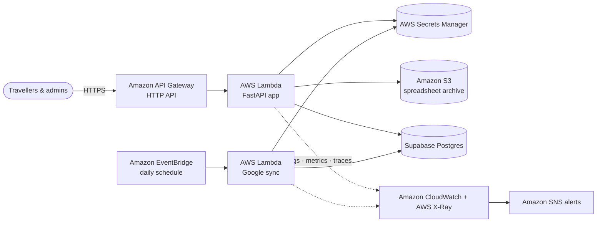

- **API Gateway + Lambda** run the FastAPI website and API, with no servers to manage.
- **Secrets Manager** holds the session key, database URL, API keys and the generated admin password.
- **S3** keeps an encrypted archive of every uploaded price spreadsheet.
- **EventBridge** triggers a daily refresh of Google reviews, ratings and locations.
- **CloudWatch** provides a dashboard, logs and alarms (errors, 5xx, latency), **X-Ray** traces requests, and
  **SNS** sends email alerts.

Everything is infrastructure-as-code in [`deploy/template.yaml`](deploy/template.yaml) and deploys with
`.\deploy\deploy.ps1`. See [docs/aws-deployment.md](docs/aws-deployment.md) for details, costs and setup.

---

## Screenshots

All screenshots come from the live deployment in AWS `af-south-1`. The providers shown are the built-in sample data.

### The app

| AI search: procedure + place + budget in one query | Provider page with services and prices |
|---|---|
| 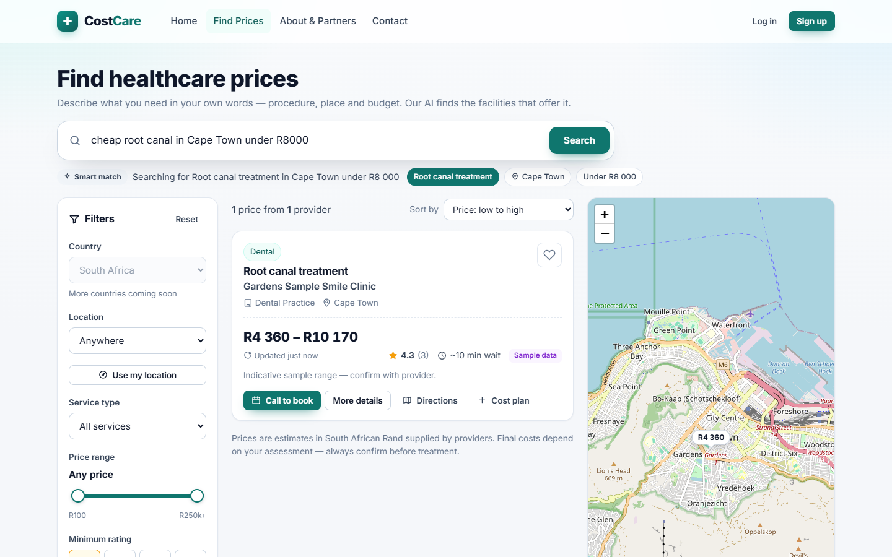 | 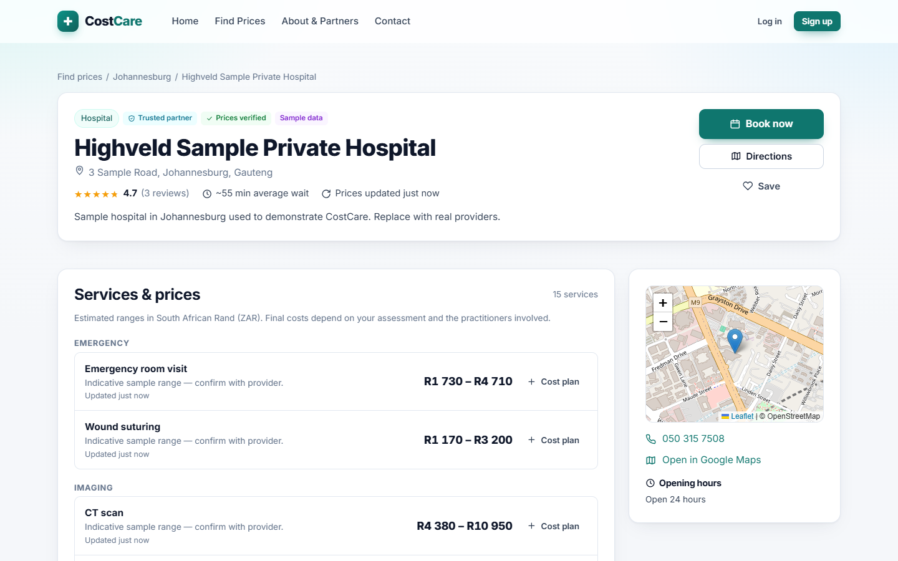 |
| **Landing page** | **Search results with map** |
| 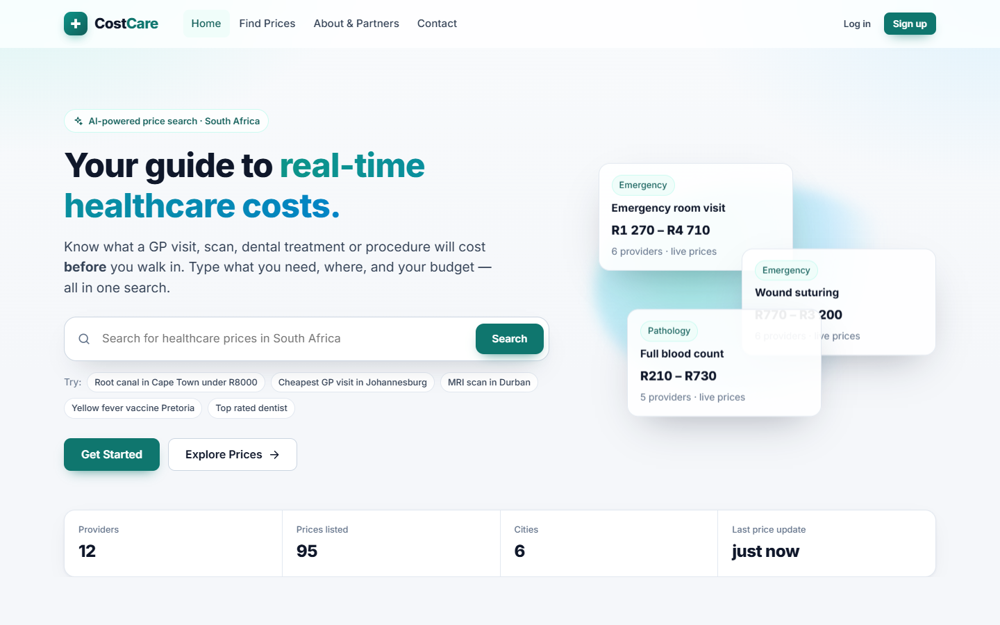 | 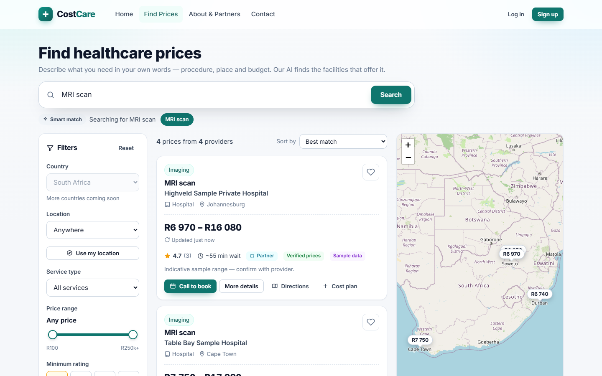 |
| **Mobile** | **REST API docs** |
| 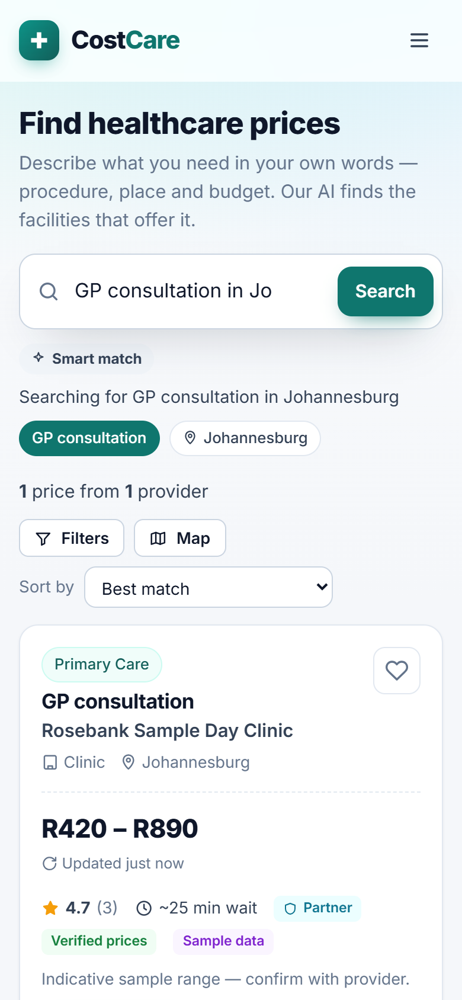 | 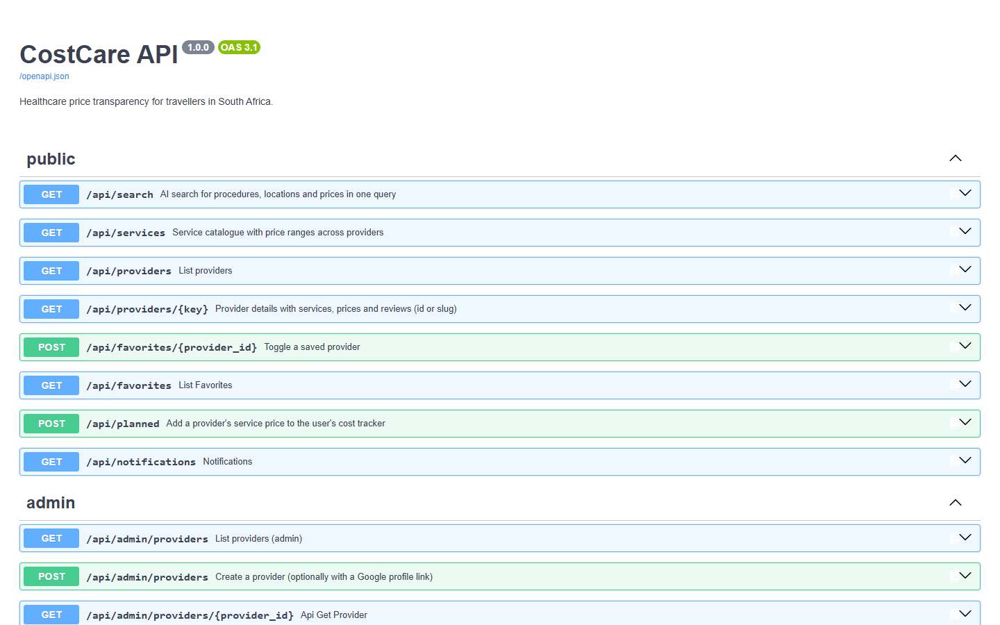 |

### Running on AWS

| CloudFormation stack (infrastructure-as-code) | CloudWatch dashboard |
|---|---|
| 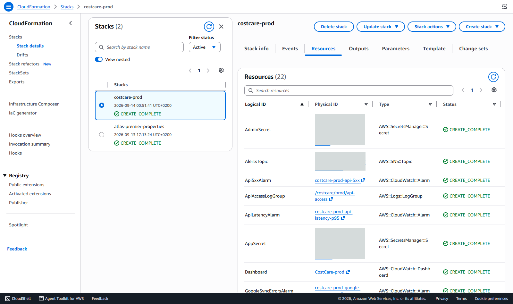 | 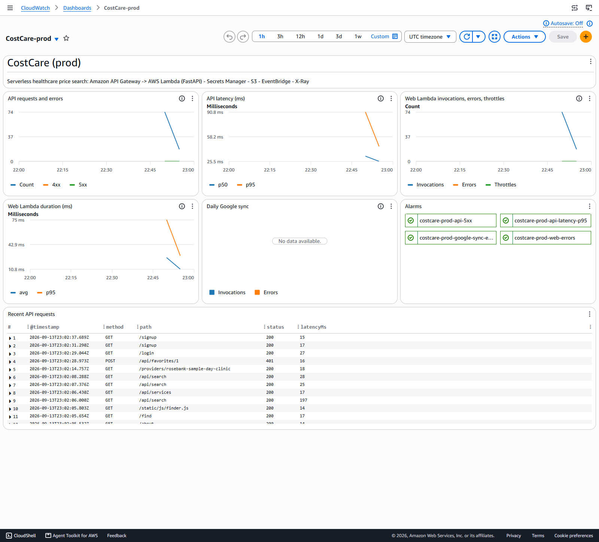 |
| **Lambda function behind API Gateway** | **Lambda monitoring** |
| 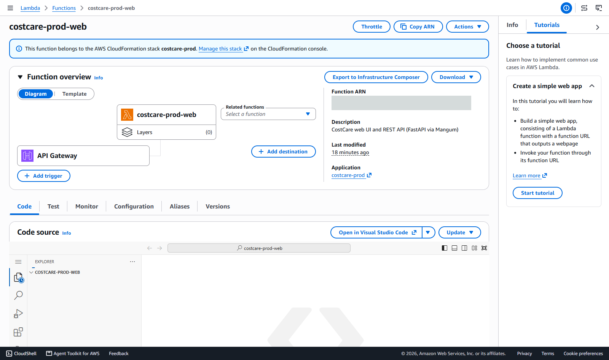 | 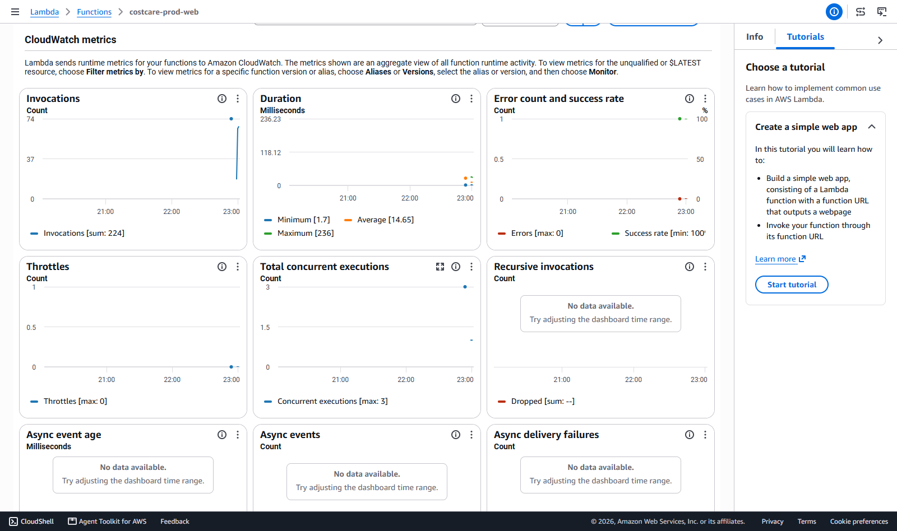 |
| **API Gateway HTTP API** | **CloudWatch alarms** |
| 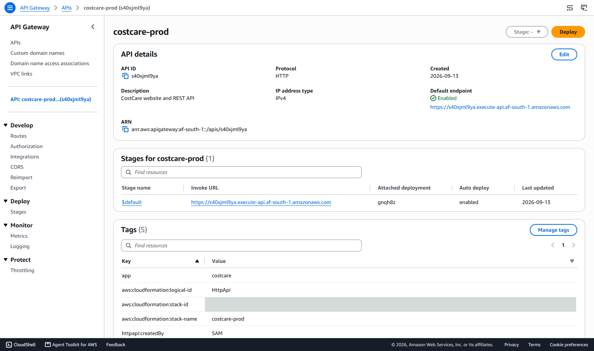 | 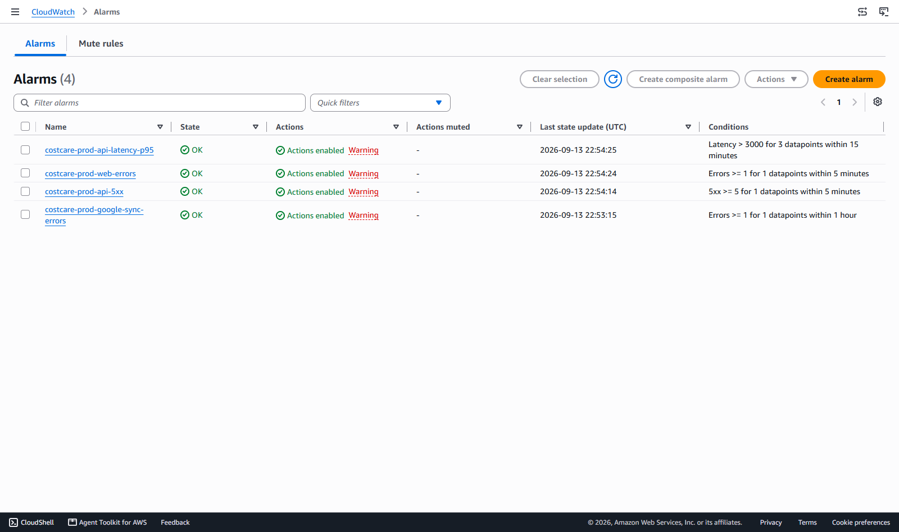 |
| **EventBridge daily Google sync** | **Scheduled Lambda** |
| 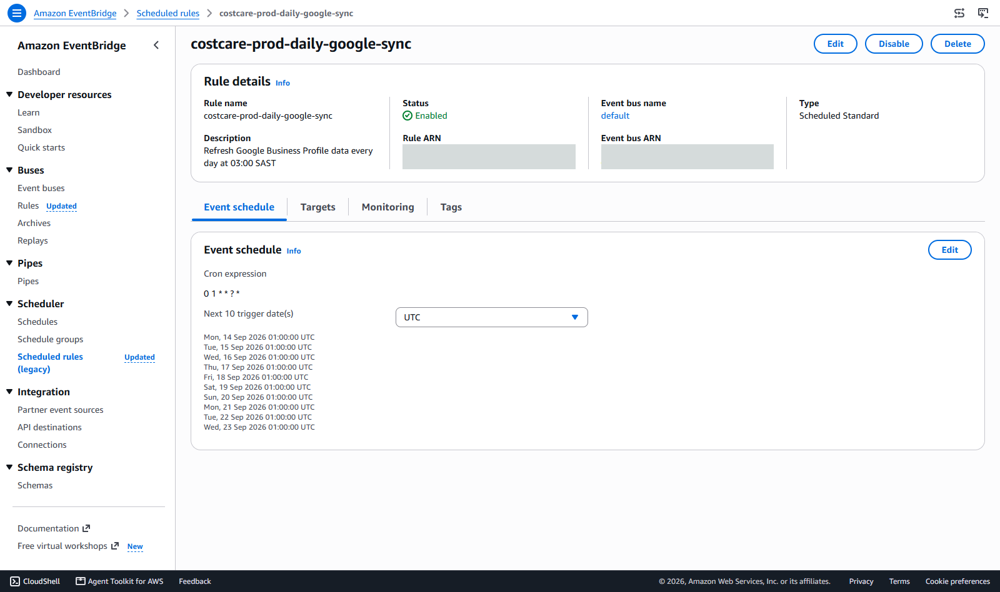 | 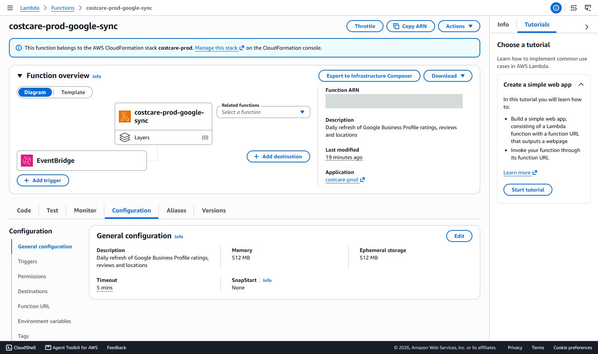 |
| **Encrypted, versioned S3 bucket** | **Secrets Manager** |
| 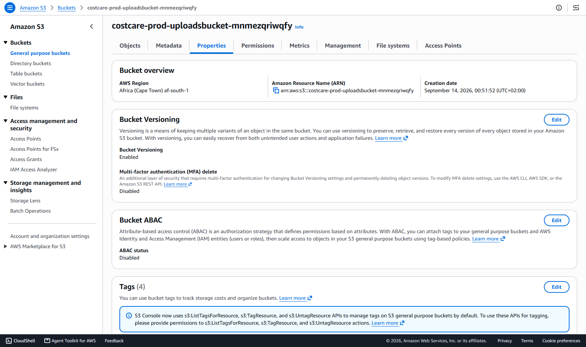 | 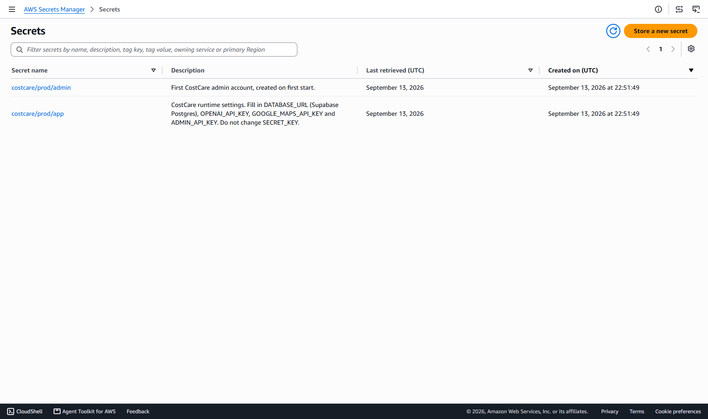 |

More detail in [docs/aws-deployment.md](docs/aws-deployment.md).

---

## Features

**Customers**
- **One AI search bar** for procedure, location, budget and rating in plain English, e.g. *“cheap root canal in
  Cape Town under R8000”*. OpenAI turns it into filters, using only services that exist in your database. A
  built-in parser (typos, city abbreviations like JHB/CPT, “5k”) takes over when no key is set.
- Results update as you type, with loading skeletons, result counts, and an “AI understood…” summary.
- Filters: location, service type, a **dual price-range slider** (log scale R100–R250k), **star rating
  buttons**, and sorting by best match, price, rating, wait time or distance (“Use my location”).
- Result cards show the price range, when it was last updated, the rating (Google), wait time, a favourite
  heart, and buttons for Book, Details, Directions and **+ Cost plan**. There's also a map with price pins.
- Provider page: services and prices grouped by category, Google reviews with attribution, community
  reviews, a map, opening hours, and Book / Directions / Save buttons.
- User dashboard: saved providers, recently viewed, a **cost tracker** (planned vs paid, showing when prices
  changed since saving), **price-change notifications**, and profile settings.
- Landing, About & Partnerships (with a partner application form), Contact + FAQs, Privacy and Terms pages.
- Sticky header, slide-out mobile menu, and a responsive layout down to phone size.

**Admin** (`/admin`)
- Add/edit providers and their **list of services with price ranges** (inline editing, availability toggle).
- **Google Business Profile linking:** paste a link and CostCare captures the **rating, review count, up to 5
  reviews, address, coordinates, phone, website and opening hours**. There's also “Preview”, “Refresh
  now”, “Sync all”, and **Discover** to import real facilities from a Google search.
- **Excel price import:** download a template (or export current prices), edit, upload, **preview every
  change**, then apply. New providers/services are created, and price history is recorded. Users who saved the
  provider are notified, and the customer site updates immediately. There's an optional “full price-list
  replacement” mode.
- Service catalogue with **keywords/synonyms** that improve AI matching.
- Dashboard: stale-price report, recent price changes, import history and messages.
- Full **REST API** with interactive docs at `/docs`.

---

## Quick start (Windows)

```bash
cd costcare
python -m venv .venv
.venv\Scripts\activate
pip install -r requirements.txt
copy .env.example .env
python run.py
```

On macOS/Linux use `source .venv/bin/activate` and `cp .env.example .env`.

Open http://127.0.0.1:8000. Log in to the admin at http://127.0.0.1:8000/login with `ADMIN_EMAIL` /
`ADMIN_PASSWORD` from `.env`. **Change these first.**

On first start the app loads a service catalogue (26 common procedures) and **12 sample providers** so you can
try everything. Sample providers carry a “Sample data” badge. Their prices are illustrative ranges and their
reviews are sample text, **not** Google reviews. Remove them in **Admin → Dashboard → Delete sample data**
once real providers are loaded, or set `SEED_DEMO_DATA=false`.

## Configuration (`.env`)

| Variable | Purpose |
|---|---|
| `SECRET_KEY` | Session signing key. Use a long random string. |
| `DATABASE_URL` | `sqlite:///./costcare.db` locally, or your Supabase Postgres URI. |
| `ADMIN_EMAIL`, `ADMIN_PASSWORD` | First admin account, created on startup. |
| `ADMIN_API_KEY` | Lets scripts call `/api/admin/*` with header `X-Admin-Token`. |
| `OPENAI_API_KEY`, `OPENAI_MODEL` | Enables AI query understanding (default model `gpt-4o-mini`). |
| `GOOGLE_MAPS_API_KEY` | Enables Google Business Profile capture (Places API (New)). |
| `STALE_PRICE_DAYS` | Age after which prices are flagged in the admin (default 90). |

### Supabase
1. Create a project, then go to **Project Settings → Database → Connection string → URI**. Use the pooler URI
   for serverless hosting.
2. Set `DATABASE_URL=postgresql+psycopg://postgres.<ref>:<password>@<host>:6543/postgres`.
3. Start the app. Tables are created automatically on first run.

### OpenAI
Set `OPENAI_API_KEY`. Each unique query costs one small request, and results are cached in memory. If
OpenAI is unreachable, search falls back to the offline parser automatically.

### Google Places API (Business Profile reviews & location)
1. In Google Cloud, enable **Places API (New)** and set up billing.
2. Create an API key **restricted to Places API (New)** and put it in `GOOGLE_MAPS_API_KEY`.
3. In **Admin → Providers → (provider) → Google Business Profile**, paste any of:
   - a Google Maps **Share** link (`https://maps.app.goo.gl/...`)
   - a full Google Maps URL (`https://www.google.com/maps/place/...`)
   - a Google Search business-profile link (`https://www.google.com/search?q=...`)
   - a place ID (`ChIJ...`) or plain text “Business name, City”

Notes:
- The Places API returns **up to 5 reviews** per place plus the total rating and review count. The provider
  page links to the full list on Google Maps.
- Requesting `reviews` is billed at Google's higher “Enterprise + Atmosphere” Place Details tier.
- Google's terms require showing reviews **with author attribution** (done) and refreshing cached Places
  content regularly. Schedule `python manage.py sync-google`, or use **Sync all**.

---

## Excel price list format

Download the template from **Admin → Import Excel prices**. One row = one service at one provider.

| Column | Required | Notes |
|---|---|---|
| Provider ID | | Leave blank for new providers; filled in by “Export current prices”. |
| Provider Name | ✔ | Matched to existing providers by ID, or name + city. |
| Provider Type | | Hospital, Clinic, Dental Practice, … |
| Address, City, Province, Phone, Email, Website, Booking URL | | Updates the provider when filled. |
| Google Business Profile URL | | Reviews/location sync in the background after import. |
| Avg Wait (minutes) | | Used for “Shortest wait” sorting. |
| Service Name | ✔ | New names are added to the catalogue. |
| Service Category | | Dental, Imaging, Surgery, … |
| Price Min (ZAR) | ✔ | Accepts `1250`, `R1 250,00`, `1.5k`. |
| Price Max (ZAR) | | Blank = fixed price. |
| Available | | Yes / No. |
| Notes | | Shown to patients (e.g. “Excludes anaesthetist”). |

Headers are flexible (“Procedure”, “Facility”, “Price from”, … also work), and `.csv` is accepted.
Uploading a price that hasn't changed still refreshes its “last updated” date.

Command line:
```bash
python manage.py import-prices prices.xlsx --apply
```

---

## API

Interactive docs are at **`/docs`**.

**Public**
- `GET /api/search?q=root canal in cape town under R8000&sort=price_asc&min_rating=4&lat=&lng=`
- `GET /api/services`, `GET /api/providers`, `GET /api/providers/{id|slug}`
- `POST /api/favorites/{provider_id}`, `POST /api/planned`, `GET /api/notifications` (signed in)

**Admin** (session or `X-Admin-Token`)
- `POST /api/admin/providers/{id}/google-profile` `{"url": "https://maps.app.goo.gl/..."}` links a Google Business
  Profile and captures reviews, rating and location
- `POST /api/admin/providers/{id}/google-sync`, `POST /api/admin/google/preview`, `POST /api/admin/google/discover`,
  `POST /api/admin/google/sync-all`
- `GET|POST /api/admin/providers`, `GET|PATCH|DELETE /api/admin/providers/{id}`
- `PUT /api/admin/providers/{id}/services` `{"service_name": "MRI scan", "price_min": 6500, "price_max": 12000}`
- `PATCH|DELETE /api/admin/listings/{id}`, `GET /api/admin/listings/{id}/history`
- `POST /api/admin/import/excel` (multipart `file`), then `POST /api/admin/import/{job_id}/apply`
- `GET /api/admin/import/template`, `GET /api/admin/export/prices`

Example:
```bash
curl -X POST http://127.0.0.1:8000/api/admin/providers/5/google-profile -H "X-Admin-Token: $ADMIN_API_KEY" -H "Content-Type: application/json" -d "{\"url\": \"https://maps.app.goo.gl/abc123\"}"
```

## Management commands

```bash
python manage.py create-admin you@example.com "strong-password"
python manage.py discover "private hospitals in Durban" --limit 10
python manage.py sync-google
python manage.py export-prices prices.xlsx
```

## Project structure

```
app/
  main.py              FastAPI app, startup (tables, admin, catalogue, sample data)
  models.py            Provider ─< ProviderService >─ Service, PriceHistory, Review, User data
  services/
    search.py          AI + rule-based query parsing, ranking
    google_places.py   Business Profile link parsing, Places API, review capture
    excel_import.py    Template, export, parse → preview → apply
    pricing.py         Price upserts, history, notifications
  routers/             pages.py (customer UI), api.py (public API), admin.py (admin UI + API)
  templates/           Jinja2 pages (admin/ for the dashboard)
  static/              CSS and JS (finder, admin)
lambda_handler.py      AWS Lambda entry points (web + scheduled Google sync)
deploy/                CloudFormation/SAM template and deploy script
docs/                  AWS deployment guide and screenshots
manage.py              CLI
tests/                 pytest suite
```

## Tests

```bash
pip install -r requirements.txt
pytest
```

The tests use a temporary SQLite database and a mocked Google API, so no keys are needed.

## Before going live
- Set strong `SECRET_KEY` / admin credentials, serve over HTTPS, and run with
  `uvicorn app.main:app --host 0.0.0.0 --port 8000 --workers 2` (no `--reload`).
- Add CSRF tokens to forms if you embed the site in other domains. Cookies are `SameSite=Lax` by default.
- Replace the sample data with real providers. Get written confirmation from providers for the prices you
  publish, and keep the “estimates only” disclaimer.
- Background Google syncs run in-process; for many providers, move them to a scheduled job or task queue.
