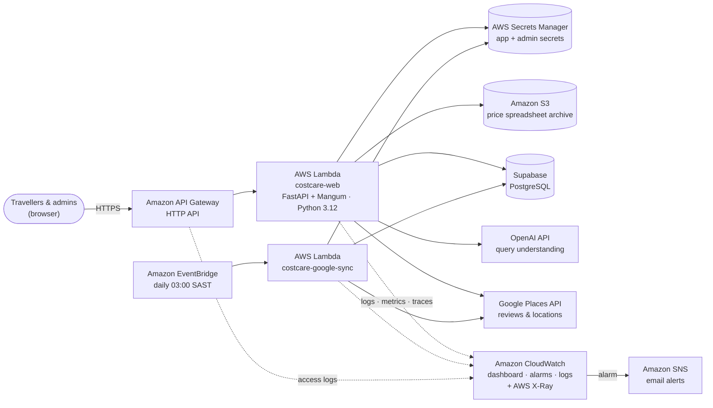

# CostCare on AWS

CostCare runs **serverless on AWS** in the **Africa (Cape Town) `af-south-1`** region, close to its South African
users. The entire stack is defined as infrastructure-as-code in [`deploy/template.yaml`](../deploy/template.yaml)
(AWS CloudFormation with the AWS SAM transform) and deployed with one command.

## Architecture



| AWS service | What CostCare uses it for |
|---|---|
| **Amazon API Gateway (HTTP API)** | Public HTTPS endpoint for the website and REST API, with throttling and JSON access logs. |
| **AWS Lambda** | `costcare-web` runs the FastAPI app (AI search, provider pages, admin dashboard, Excel import) through the Mangum adapter. `costcare-google-sync` refreshes Google Business Profile data. |
| **AWS Secrets Manager** | Stores `SECRET_KEY`, the database URL, OpenAI/Google API keys, and a generated admin password. Loaded once per cold start; nothing sensitive is kept in code or environment variables. |
| **Amazon S3** | Encrypted, versioned, private bucket that archives every uploaded price spreadsheet for auditing. Moves files to Infrequent Access after 30 days. |
| **Amazon EventBridge** | Daily schedule that triggers the Google reviews/ratings/location refresh (Google's terms require regular refreshes of cached Places data). |
| **Amazon CloudWatch** | Log groups with 30-day retention, a `CostCare-prod` dashboard, and alarms for Lambda errors, API 5xx responses, p95 latency and failed syncs. |
| **AWS X-Ray** | Request tracing across API Gateway and Lambda, including calls to OpenAI, Google and the database. |
| **Amazon SNS** | Sends alarm notifications by email. |
| **AWS IAM** | Least-privilege roles generated per function (read two secrets, write to one bucket, write logs/traces). |

### In the AWS console

These are captured from the live `costcare-prod` stack in `af-south-1` using
[`deploy/console_screenshots.py`](../deploy/console_screenshots.py). That script signs in with a temporary
read-only session and cannot read secret values.


The database is **Supabase Postgres**, reached over TLS from Lambda. Lambda doesn't run inside a VPC, so it
doesn't need a NAT gateway, which keeps costs close to zero.

## Deploy

Prerequisites: AWS CLI v2 configured (`aws configure`) and Python 3 on your PATH. Docker isn't needed.

```bash
.\deploy\deploy.ps1
```

The script:
1. Builds a Linux-compatible Lambda package (`pip install --platform manylinux…`) into `build/lambda`.
2. Creates a private artifacts bucket and runs `aws cloudformation package`.
3. Runs `aws cloudformation deploy` for the `costcare-prod` stack and prints the website URL.

Options: `-Region af-south-1 -Stage prod -AlarmEmail you@example.com -SkipBuild`.

### After the first deploy

1. **Admin login:** AWS console → Secrets Manager → `costcare/prod/admin` → *Retrieve secret value*.
2. **Connect Supabase** (see below), and optionally add `OPENAI_API_KEY`, `GOOGLE_MAPS_API_KEY` and
   `ADMIN_API_KEY` to the same secret.
3. **Reload settings:** `.\deploy\deploy.ps1 -SkipBuild -ConfigVersion 2` (use a higher number each time you edit
   the secret), then open `/healthz` on the website URL.

### Connect the Supabase database

1. In Supabase, create a project (or open yours) → **Connect** → **Transaction pooler**, and copy the URI. It
   looks like `postgresql://postgres.<project-ref>:[YOUR-PASSWORD]@aws-0-<region>.pooler.supabase.com:6543/postgres`.
   - Use the **pooler** URI, not the direct `db.<ref>.supabase.co` one. The direct connection is IPv6-only, and
     Lambda outside a VPC can only reach IPv4.
   - Transaction pooling (port 6543) suits Lambda. CostCare turns off prepared statements for it automatically.
   - Replace `[YOUR-PASSWORD]` with your database password. If it contains characters like `@`, `:`, `/` or
     `#`, URL-encode them (e.g. `@` → `%40`).
   - Add `?sslmode=require` to the end so the connection is always encrypted.
2. AWS console → **Secrets Manager** → `costcare/prod/app` → **Retrieve secret value** → **Edit**. Paste the URI
   into `DATABASE_URL` and save. Leave `SECRET_KEY` unchanged.
3. Reload settings: `.\deploy\deploy.ps1 -SkipBuild -ConfigVersion 2`. After deploying, the script runs a one-off
   **setup task** on the `costcare-prod-google-sync` function, which has a 5-minute timeout. The task:
   - creates the tables in Supabase,
   - creates the admin account from `costcare/prod/admin`,
   - creates the service catalogue,
   - loads the sample providers, unless you deployed with `-SeedDemoData false`.

   It's safe to run again.
4. Open `https://<api-id>.execute-api.af-south-1.amazonaws.com/healthz`. It should show `"database": "postgresql"`.

If setup reports `password authentication failed`, fix the password in `DATABASE_URL`:
- URL-encode special characters.
- Use the user name `postgres.<project-ref>` exactly as Supabase shows it.
- Remove the `[` `]` placeholder brackets.

You can reset the password in Supabase → Project Settings → Database.

**Latency:** Lambda runs in Cape Town and Supabase has no Cape Town region, so every query travels to the region
you chose. To keep requests quick, setup runs outside web requests, and each Lambda instance reuses its database
connection between requests.

**Security:** Supabase serves tables in the `public` schema through its REST API with your project's public
anon key. CostCare enables **row level security** on its tables at startup, with no policies, so that API can't
read them (including the `users` table). The app itself connects as the table owner and is unaffected.

**Demo mode:** until `DATABASE_URL` is set, each Lambda instance uses a temporary SQLite database in `/tmp`
seeded with the sample providers. That's fine for a demo, but admin changes don't persist and can differ
between instances. Set `DATABASE_URL` for real use.

## Costs

For a low-traffic launch this is roughly **US$1–2 per month**:
- Lambda, API Gateway, X-Ray and CloudWatch alarms: mostly within the AWS Free Tier.
- Secrets Manager: US$0.40 per secret per month (2 secrets).
- S3 and CloudWatch Logs: cents.

Supabase, OpenAI and Google Places are billed separately by those providers.

## Limits to know

- API Gateway + Lambda accept request bodies up to about 6 MB, so keep uploaded spreadsheets below ~4 MB.
- API Gateway times out after 30 seconds. Long Google syncs run in the separate scheduled function, which
  has a 5-minute timeout.

## Tear down

```bash
aws cloudformation delete-stack --stack-name costcare-prod --region af-south-1
```

The uploads bucket is retained on purpose so archived spreadsheets aren't lost. Empty and delete it manually
if you no longer need it.
